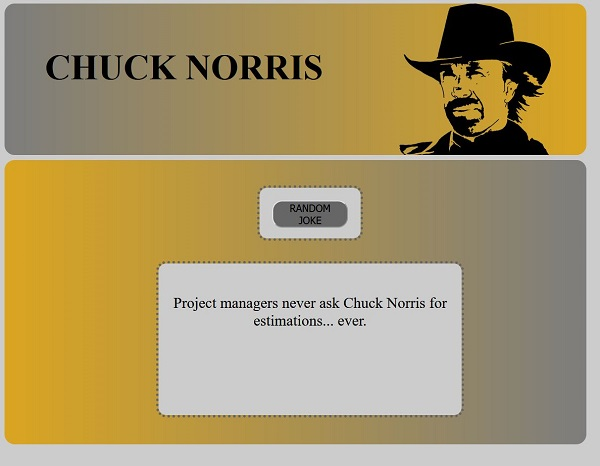
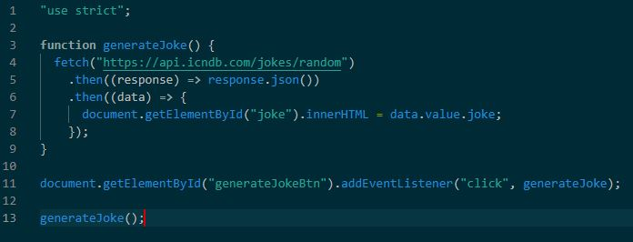

# Chuck-Norris-Joke

## Table of contents

- [General info](#general-info)
- [Screenshots](#screenshots)
- [Technologies](#technologies)
- [Contact](#contact)

## General info

Zadanie wykonane w ramamch bootcampu Kodilla - "Web developer"
Opis: Przećwiczenie wykorzystania technologii AJAX.
Aplikacja pobiera losowy dowcip o Chucku Norrisie z API http://api.icndb.com .

## Screenshots

## Technologies

- HTML 5
- CSS 3
- RWD
- Sass
- JavaScript
- AJAX
- API

## Code Examples

## Contact

Created by me - feel free to contact me!
